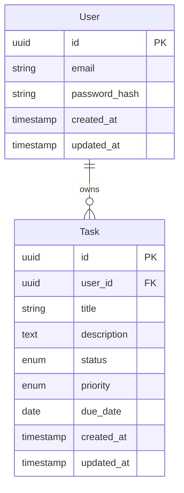

# Skill Specification: Database Schema

**Version**: 1.0.0
**Created**: 2026-01-15
**Category**: Data & Persistence
**Phase Coverage**: II, III, IV, V

---

## Purpose

Generates database schemas, migrations, and ORM models from feature specifications. Ensures proper user isolation, indexing, and cloud-native design for Neon PostgreSQL with support for schema evolution and data integrity.

**Core Mission**: Transform entity specifications into production-ready database schemas with migrations, ORM models, and proper constraints.

---

## Inputs

### Required Inputs

```typescript
interface DatabaseSchemaInput {
  spec_file: string;                    // Path to feature spec.md
  entities: Entity[];                   // Key entities with attributes
  database_provider: string;            // "neon-postgresql" (default)
  migration_tool: string;               // "alembic" (default), "prisma"
  indexing_strategy?: IndexStrategy;    // Performance optimization rules
}

interface Entity {
  name: string;                         // e.g., "Task"
  attributes: Record<string, string>;   // e.g., { "id": "uuid", "title": "string(200)" }
  indexes?: string[];                   // Columns to index
  constraints?: string[];               // Check constraints
  relationships?: Relationship[];       // Foreign keys
  soft_delete?: boolean;                // Add deleted_at column
}

interface Relationship {
  type: "one-to-many" | "many-to-one" | "many-to-many";
  target_entity: string;
  foreign_key?: string;
  cascade?: "CASCADE" | "RESTRICT" | "SET NULL";
}

interface IndexStrategy {
  user_scoped_tables: boolean;          // Auto-index user_id columns
  timestamp_columns: boolean;           // Auto-index created_at, updated_at
  enum_columns: boolean;                // Auto-index enum columns
  composite_indexes?: string[][];       // Multi-column indexes
}
```

### Example Input

```json
{
  "spec_file": "specs/001-task-management/spec.md",
  "entities": [
    {
      "name": "Task",
      "attributes": {
        "id": "uuid",
        "user_id": "uuid",
        "title": "string(200)",
        "description": "text",
        "status": "enum(todo,in_progress,done)",
        "priority": "enum(low,medium,high)",
        "due_date": "date",
        "created_at": "timestamp",
        "updated_at": "timestamp"
      },
      "indexes": ["user_id", "status", "due_date"],
      "constraints": ["title NOT NULL", "user_id NOT NULL"],
      "relationships": [
        {
          "type": "many-to-one",
          "target_entity": "User",
          "foreign_key": "user_id",
          "cascade": "CASCADE"
        }
      ]
    }
  ],
  "database_provider": "neon-postgresql",
  "migration_tool": "alembic"
}
```

---

## Outputs

### Primary Outputs

```typescript
interface DatabaseSchemaOutput {
  schema: {
    sql: string;                        // CREATE TABLE statements
    file_path: string;                  // specs/<feature>/schema.sql
  };
  migrations: {
    upgrade: string;                    // Alembic upgrade function
    downgrade: string;                  // Alembic rollback function
    file_path: string;                  // backend/migrations/versions/<id>_<name>.py
  };
  orm_models: {
    sqlalchemy: string;                 // SQLAlchemy models
    file_path: string;                  // backend/src/db/models/<entity>.py
  };
  seed_data?: {
    sql: string;                        // INSERT statements
    file_path: string;                  // backend/seeds/<id>_<entity>.sql
  };
  documentation: {
    data_model: string;                 // ER diagram and schema docs
    file_path: string;                  // specs/<feature>/data-model.md
  };
}
```

---

## Rules

### User Isolation Rules (Non-Negotiable)

1. **MUST include user_id column on all user-scoped tables**
   - Type: UUID (foreign key to users.id)
   - NOT NULL constraint
   - Indexed for query performance
   - CASCADE on delete (or RESTRICT based on requirements)

2. **MUST create indexes on user_id for query performance**
   - Single-column index on user_id
   - Composite indexes for common query patterns (user_id + status, user_id + created_at)

3. **MUST use UUID for primary keys** (not auto-increment integers)
   - Better for distributed systems
   - No sequential ID leakage
   - Compatible with Neon PostgreSQL

### Data Integrity Rules

4. **MUST include created_at and updated_at timestamps**
   - created_at: Set on insert, never updated
   - updated_at: Set on insert, updated on every change
   - Use database triggers or ORM hooks

5. **MUST use proper foreign key constraints**
   - Define relationships explicitly
   - Choose appropriate CASCADE behavior
   - RESTRICT for critical relationships
   - CASCADE for dependent data

6. **MUST implement check constraints for data validation**
   - Enum validation at database level
   - Range constraints (e.g., age > 0)
   - Format constraints (e.g., email pattern)

### Performance Rules

7. **MUST use prepared statements** (parameterized queries)
   - SQLAlchemy ORM provides this automatically
   - Never concatenate user input into SQL

8. **MUST support connection pooling for Neon PostgreSQL**
   - Configure SQLAlchemy pool size
   - Set appropriate pool timeout
   - Handle connection errors gracefully

9. **MUST avoid N+1 query problems**
   - Use eager loading (joinedload, selectinload)
   - Define relationships in ORM models
   - Optimize common query patterns

### Migration Rules

10. **MUST include migration rollback capability**
    - Every upgrade() must have corresponding downgrade()
    - Test rollback before deploying
    - Document breaking changes

11. **MUST document all schema changes in migration files**
    - Clear migration description
    - Reason for change
    - Impact on existing data

12. **MUST support soft deletes if specified**
    - Add deleted_at column (nullable timestamp)
    - Filter out soft-deleted records in queries
    - Provide undelete capability

---

## Reusability

### Scope
- All data-driven features across Phases II-V
- Any PostgreSQL-compatible database
- Any application requiring structured data storage

### Portability
- SQL patterns work across PostgreSQL-compatible databases
- SQLAlchemy models portable across Python frameworks
- Can be adapted for other ORMs (Prisma, TypeORM, etc.)

### Composability
- Integrates with API Generator for data access layer
- Integrates with Authentication & Security for user tables
- Feeds into Backend Agent for implementation

### Extensibility
- Supports multiple ORMs (SQLAlchemy, Prisma, TypeORM)
- Can add custom column types
- Can add database-specific features (PostgreSQL arrays, JSONB)

---

## Example Execution

### Input
```json
{
  "entities": [{
    "name": "Task",
    "attributes": {
      "id": "uuid",
      "user_id": "uuid",
      "title": "string(200)",
      "description": "text",
      "status": "enum(todo,in_progress,done)",
      "priority": "enum(low,medium,high)",
      "due_date": "date",
      "created_at": "timestamp",
      "updated_at": "timestamp"
    },
    "indexes": ["user_id", "status", "due_date"],
    "constraints": ["title NOT NULL", "user_id NOT NULL"]
  }]
}
```

### Generated SQL Schema

```sql
-- specs/001-task-management/schema.sql

-- Enum types
CREATE TYPE task_status AS ENUM ('todo', 'in_progress', 'done');
CREATE TYPE task_priority AS ENUM ('low', 'medium', 'high');

-- Tasks table
CREATE TABLE tasks (
    id UUID PRIMARY KEY DEFAULT gen_random_uuid(),
    user_id UUID NOT NULL REFERENCES users(id) ON DELETE CASCADE,
    title VARCHAR(200) NOT NULL,
    description TEXT,
    status task_status NOT NULL DEFAULT 'todo',
    priority task_priority NOT NULL DEFAULT 'medium',
    due_date DATE,
    created_at TIMESTAMP NOT NULL DEFAULT CURRENT_TIMESTAMP,
    updated_at TIMESTAMP NOT NULL DEFAULT CURRENT_TIMESTAMP,

    -- Constraints
    CONSTRAINT title_not_empty CHECK (LENGTH(TRIM(title)) > 0)
);

-- Indexes for performance
CREATE INDEX idx_tasks_user_id ON tasks(user_id);
CREATE INDEX idx_tasks_status ON tasks(status);
CREATE INDEX idx_tasks_due_date ON tasks(due_date);
CREATE INDEX idx_tasks_user_status ON tasks(user_id, status);
CREATE INDEX idx_tasks_user_due_date ON tasks(user_id, due_date);

-- Trigger for updated_at
CREATE OR REPLACE FUNCTION update_updated_at_column()
RETURNS TRIGGER AS $$
BEGIN
    NEW.updated_at = CURRENT_TIMESTAMP;
    RETURN NEW;
END;
$$ LANGUAGE plpgsql;

CREATE TRIGGER update_tasks_updated_at
    BEFORE UPDATE ON tasks
    FOR EACH ROW
    EXECUTE FUNCTION update_updated_at_column();

-- Comments for documentation
COMMENT ON TABLE tasks IS 'User tasks with priority and status tracking';
COMMENT ON COLUMN tasks.user_id IS 'Owner of the task (row-level security)';
COMMENT ON COLUMN tasks.status IS 'Current status: todo, in_progress, or done';
COMMENT ON COLUMN tasks.priority IS 'Priority level: low, medium, or high';
```

### Generated Alembic Migration

```python
# backend/migrations/versions/001_create_tasks_table.py
"""Create tasks table

Revision ID: 001
Revises:
Create Date: 2026-01-15 10:00:00.000000

"""
from alembic import op
import sqlalchemy as sa
from sqlalchemy.dialects import postgresql

# revision identifiers, used by Alembic.
revision = '001'
down_revision = None
branch_labels = None
depends_on = None

def upgrade():
    """Create tasks table with user isolation and proper indexing."""

    # Create enum types
    task_status = postgresql.ENUM('todo', 'in_progress', 'done', name='task_status')
    task_status.create(op.get_bind())

    task_priority = postgresql.ENUM('low', 'medium', 'high', name='task_priority')
    task_priority.create(op.get_bind())

    # Create tasks table
    op.create_table(
        'tasks',
        sa.Column('id', postgresql.UUID(as_uuid=True), primary_key=True, server_default=sa.text('gen_random_uuid()')),
        sa.Column('user_id', postgresql.UUID(as_uuid=True), nullable=False),
        sa.Column('title', sa.String(200), nullable=False),
        sa.Column('description', sa.Text()),
        sa.Column('status', task_status, nullable=False, server_default='todo'),
        sa.Column('priority', task_priority, nullable=False, server_default='medium'),
        sa.Column('due_date', sa.Date()),
        sa.Column('created_at', sa.TIMESTAMP(), nullable=False, server_default=sa.text('CURRENT_TIMESTAMP')),
        sa.Column('updated_at', sa.TIMESTAMP(), nullable=False, server_default=sa.text('CURRENT_TIMESTAMP')),

        # Foreign key constraint
        sa.ForeignKeyConstraint(['user_id'], ['users.id'], ondelete='CASCADE'),

        # Check constraints
        sa.CheckConstraint("LENGTH(TRIM(title)) > 0", name='title_not_empty')
    )

    # Create indexes
    op.create_index('idx_tasks_user_id', 'tasks', ['user_id'])
    op.create_index('idx_tasks_status', 'tasks', ['status'])
    op.create_index('idx_tasks_due_date', 'tasks', ['due_date'])
    op.create_index('idx_tasks_user_status', 'tasks', ['user_id', 'status'])
    op.create_index('idx_tasks_user_due_date', 'tasks', ['user_id', 'due_date'])

    # Create trigger for updated_at
    op.execute("""
        CREATE OR REPLACE FUNCTION update_updated_at_column()
        RETURNS TRIGGER AS $$
        BEGIN
            NEW.updated_at = CURRENT_TIMESTAMP;
            RETURN NEW;
        END;
        $$ LANGUAGE plpgsql;
    """)

    op.execute("""
        CREATE TRIGGER update_tasks_updated_at
            BEFORE UPDATE ON tasks
            FOR EACH ROW
            EXECUTE FUNCTION update_updated_at_column();
    """)

def downgrade():
    """Drop tasks table and related objects."""

    # Drop trigger
    op.execute("DROP TRIGGER IF EXISTS update_tasks_updated_at ON tasks")
    op.execute("DROP FUNCTION IF EXISTS update_updated_at_column()")

    # Drop indexes
    op.drop_index('idx_tasks_user_due_date', 'tasks')
    op.drop_index('idx_tasks_user_status', 'tasks')
    op.drop_index('idx_tasks_due_date', 'tasks')
    op.drop_index('idx_tasks_status', 'tasks')
    op.drop_index('idx_tasks_user_id', 'tasks')

    # Drop table
    op.drop_table('tasks')

    # Drop enum types
    op.execute("DROP TYPE IF EXISTS task_priority")
    op.execute("DROP TYPE IF EXISTS task_status")
```

### Generated SQLAlchemy Model

```python
# backend/src/db/models/task.py
from sqlalchemy import Column, String, Text, Enum, Date, ForeignKey, CheckConstraint
from sqlalchemy.dialects.postgresql import UUID
from sqlalchemy.orm import relationship
from datetime import datetime
import uuid
import enum

from .base import Base, TimestampMixin

class TaskStatus(str, enum.Enum):
    """Task status enumeration."""
    TODO = "todo"
    IN_PROGRESS = "in_progress"
    DONE = "done"

class TaskPriority(str, enum.Enum):
    """Task priority enumeration."""
    LOW = "low"
    MEDIUM = "medium"
    HIGH = "high"

class Task(Base, TimestampMixin):
    """
    Task model with user isolation.

    All queries MUST filter by user_id to enforce row-level security.
    """
    __tablename__ = "tasks"

    # Primary key
    id = Column(UUID(as_uuid=True), primary_key=True, default=uuid.uuid4)

    # User isolation (row-level security)
    user_id = Column(
        UUID(as_uuid=True),
        ForeignKey("users.id", ondelete="CASCADE"),
        nullable=False,
        index=True
    )

    # Task attributes
    title = Column(String(200), nullable=False)
    description = Column(Text)
    status = Column(
        Enum(TaskStatus, name="task_status"),
        nullable=False,
        default=TaskStatus.TODO,
        index=True
    )
    priority = Column(
        Enum(TaskPriority, name="task_priority"),
        nullable=False,
        default=TaskPriority.MEDIUM
    )
    due_date = Column(Date, index=True)

    # Relationships
    user = relationship("User", back_populates="tasks")

    # Table constraints
    __table_args__ = (
        CheckConstraint("LENGTH(TRIM(title)) > 0", name="title_not_empty"),
        # Composite indexes for common queries
        {"comment": "User tasks with priority and status tracking"}
    )

    def __repr__(self):
        return f"<Task(id={self.id}, title='{self.title}', status={self.status})>"

    @classmethod
    def get_by_user(cls, db, user_id: uuid.UUID):
        """Get all tasks for a specific user (row-level security)."""
        return db.query(cls).filter(cls.user_id == user_id).all()

    @classmethod
    def get_by_user_and_status(cls, db, user_id: uuid.UUID, status: TaskStatus):
        """Get tasks filtered by user and status."""
        return db.query(cls).filter(
            cls.user_id == user_id,
            cls.status == status
        ).all()
```

### Generated Base Models

```python
# backend/src/db/models/base.py
from sqlalchemy.ext.declarative import declarative_base
from sqlalchemy import Column, TIMESTAMP
from sqlalchemy.sql import func

Base = declarative_base()

class TimestampMixin:
    """Mixin for created_at and updated_at timestamps."""

    created_at = Column(
        TIMESTAMP,
        nullable=False,
        server_default=func.current_timestamp()
    )

    updated_at = Column(
        TIMESTAMP,
        nullable=False,
        server_default=func.current_timestamp(),
        onupdate=func.current_timestamp()
    )
```

### Generated Data Model Documentation

```markdown
# Data Model: Task Management

## Entity Relationship Diagram



## Tables

### tasks

**Purpose**: Store user tasks with priority and status tracking

**Row-Level Security**: All queries MUST filter by user_id

| Column | Type | Constraints | Description |
|--------|------|-------------|-------------|
| id | UUID | PRIMARY KEY | Unique task identifier |
| user_id | UUID | NOT NULL, FK(users.id) | Task owner (row-level security) |
| title | VARCHAR(200) | NOT NULL | Task title |
| description | TEXT | | Task description |
| status | ENUM | NOT NULL, DEFAULT 'todo' | Current status (todo, in_progress, done) |
| priority | ENUM | NOT NULL, DEFAULT 'medium' | Priority level (low, medium, high) |
| due_date | DATE | | Task due date |
| created_at | TIMESTAMP | NOT NULL | Creation timestamp |
| updated_at | TIMESTAMP | NOT NULL | Last update timestamp |

**Indexes**:
- `idx_tasks_user_id` on (user_id)
- `idx_tasks_status` on (status)
- `idx_tasks_due_date` on (due_date)
- `idx_tasks_user_status` on (user_id, status)
- `idx_tasks_user_due_date` on (user_id, due_date)

**Constraints**:
- `title_not_empty`: LENGTH(TRIM(title)) > 0
- Foreign key: user_id → users.id (CASCADE on delete)

## Query Patterns

### Get all tasks for a user
```sql
SELECT * FROM tasks WHERE user_id = $1 ORDER BY created_at DESC;
```

### Get tasks by status
```sql
SELECT * FROM tasks WHERE user_id = $1 AND status = $2;
```

### Get overdue tasks
```sql
SELECT * FROM tasks
WHERE user_id = $1
  AND status != 'done'
  AND due_date < CURRENT_DATE;
```

## Migration History

- **001**: Create tasks table with user isolation and indexing
```

**Output Summary**:
- ✅ Complete SQL schema with enums, constraints, indexes
- ✅ Alembic migration with upgrade/downgrade
- ✅ SQLAlchemy ORM models with relationships
- ✅ Row-level security (user_id filtering)
- ✅ Timestamp triggers for updated_at
- ✅ Comprehensive data model documentation
- ✅ Query pattern examples

---

## Integration with Other Skills

### Depends On
- **Spec-Driven Builder**: Provides entity definitions from specifications

### Feeds Into
- **API Generator**: Provides ORM models for data access
- **Backend Agent**: Provides database structure for implementation
- **Testing**: Provides schema for test database setup

---

## Performance Characteristics

- **Generation Time**: 45-60 seconds for typical schema
- **Query Performance**: < 50ms with proper indexing
- **Migration Time**: < 5 seconds for typical schema
- **Rollback Time**: < 3 seconds

---

## Version History

- **1.0.0** (2026-01-15): Initial skill specification
