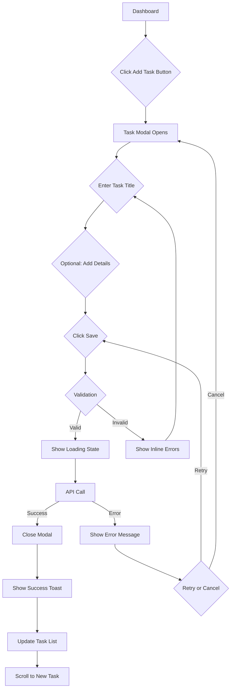
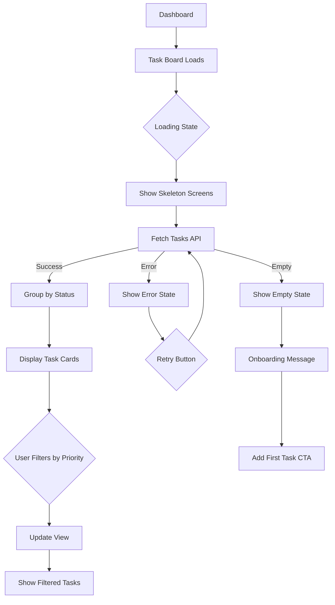
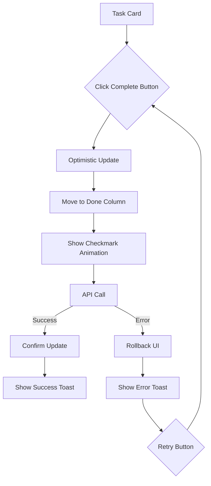

# Skill Specification: UX Flow Designer

**Version**: 1.0.0
**Created**: 2026-01-15
**Category**: Design & User Experience
**Phase Coverage**: II, III, IV, V

---

## Purpose

Designs user experience flows, component hierarchies, and interaction patterns for premium SaaS interfaces. Ensures intuitive navigation, proper state management, and delightful user interactions across all devices.

**Core Mission**: Create comprehensive UX specifications that guide implementation of accessible, responsive, and user-friendly interfaces.

---

## Inputs

### Required Inputs

```typescript
interface UXFlowDesignerInput {
  user_stories: string[];               // Prioritized user journeys from spec
  screen_types: string[];               // "landing", "dashboard", "forms", "modals"
  navigation_pattern: string;           // "sidebar", "top-nav", "tabs", "wizard"
  interaction_complexity: string;       // "simple", "moderate", "complex"
  device_targets: string[];             // ["mobile", "tablet", "desktop"]
}
```

### Example Input

```json
{
  "user_stories": [
    "As a user, I want to quickly add a new task",
    "As a user, I want to see all my tasks organized by priority",
    "As a user, I want to mark tasks as complete"
  ],
  "screen_types": ["landing", "dashboard", "task-modal"],
  "navigation_pattern": "sidebar",
  "interaction_complexity": "moderate",
  "device_targets": ["mobile", "tablet", "desktop"]
}
```

---

## Outputs

### Primary Outputs

```typescript
interface UXFlowDesignerOutput {
  user_flow_diagrams: {
    mermaid: string;                    // Mermaid flowchart syntax
    file_path: string;                  // specs/<feature>/ux-flows.md
  };
  component_hierarchy: {
    json: string;                       // Component tree structure
    file_path: string;                  // specs/<feature>/component-hierarchy.json
  };
  interaction_specs: {
    markdown: string;                   // Detailed interaction specifications
    file_path: string;                  // specs/<feature>/interaction-specs.md
  };
  responsive_breakpoints: {
    css: string;                        // Media query definitions
    file_path: string;                  // frontend/src/styles/breakpoints.css
  };
  accessibility_checklist: {
    markdown: string;                   // ARIA labels, keyboard nav
    file_path: string;                  // specs/<feature>/accessibility-checklist.md
  };
}
```

---

## Rules

### Mobile-First Rules (Non-Negotiable)

1. **MUST design mobile-first** (start with 320px viewport)
   - Design for smallest screen first
   - Progressive enhancement for larger screens
   - Touch-friendly targets (44x44px minimum)
   - Avoid hover-only interactions

2. **MUST include loading states for all async operations**
   - Spinners for quick operations (< 2s)
   - Skeleton screens for content loading
   - Progress bars for long operations (> 2s)
   - Optimistic UI updates where appropriate

3. **MUST include error states with recovery actions**
   - Clear error messages
   - Actionable recovery steps
   - Retry buttons
   - Contact support links

4. **MUST include empty states with onboarding guidance**
   - Illustrations or icons
   - Clear explanation of feature
   - Call-to-action to get started
   - Example data or templates

5. **MUST support keyboard navigation**
   - Tab order follows visual order
   - Enter key submits forms
   - Escape key closes modals
   - Arrow keys for lists/menus

### Accessibility Rules

6. **MUST include ARIA labels for screen readers**
   - aria-label for icon buttons
   - aria-describedby for form fields
   - aria-live for dynamic content
   - role attributes for custom components

7. **MUST show success feedback for user actions**
   - Toast notifications
   - Inline success messages
   - Visual confirmations (checkmarks)
   - Haptic feedback on mobile

8. **MUST implement optimistic UI updates** where appropriate
   - Immediate visual feedback
   - Rollback on error
   - Loading indicators for confirmation
   - Conflict resolution UI

9. **MUST avoid layout shift (CLS)** during loading
   - Reserve space for dynamic content
   - Use skeleton screens
   - Fixed dimensions for images
   - Avoid inserting content above fold

10. **MUST include focus indicators for keyboard users**
    - Visible focus outlines (2px)
    - High contrast focus colors
    - Never remove focus styles
    - Support :focus-visible

### Interaction Rules

11. **MUST support touch gestures on mobile**
    - Swipe to delete/archive
    - Pull to refresh
    - Pinch to zoom (where appropriate)
    - Long press for context menus

12. **MUST follow platform conventions**
    - iOS: Bottom navigation, swipe gestures
    - Android: Material Design patterns
    - Web: Standard browser behaviors

---

## Reusability

### Scope
- All user-facing features across Phases II-V
- Any web application requiring UX design
- Any React/Vue/Svelte application

### Portability
- UX patterns work across any framework
- Component hierarchies are framework-agnostic
- Can be adapted for mobile apps

### Composability
- Integrates with UI Theme Designer for styling
- Feeds into Frontend Agent for implementation
- Can be extended with custom patterns

### Extensibility
- Component-based design allows easy composition
- Can add custom interaction patterns
- Supports multiple navigation patterns

---

## Example Execution

### Input
```json
{
  "user_stories": [
    "As a user, I want to quickly add a new task",
    "As a user, I want to see all my tasks organized by priority"
  ],
  "screen_types": ["dashboard", "task-modal"],
  "navigation_pattern": "sidebar",
  "device_targets": ["mobile", "tablet", "desktop"]
}
```

### Generated User Flow Diagram

```markdown
# User Experience Flows: Task Management

## Flow 1: Quick Task Creation



## Flow 2: View Tasks by Priority



## Flow 3: Mark Task Complete


```

### Generated Component Hierarchy

```json
{
  "pages": {
    "Dashboard": {
      "path": "/dashboard",
      "components": [
        {
          "name": "DashboardLayout",
          "type": "layout",
          "children": [
            {
              "name": "Sidebar",
              "type": "navigation",
              "props": {
                "isCollapsible": true,
                "defaultOpen": true
              },
              "children": [
                {
                  "name": "Logo",
                  "type": "ui"
                },
                {
                  "name": "NavLinks",
                  "type": "navigation",
                  "items": ["Dashboard", "Tasks", "Settings"]
                },
                {
                  "name": "UserMenu",
                  "type": "ui"
                }
              ]
            },
            {
              "name": "MainContent",
              "type": "layout",
              "children": [
                {
                  "name": "Header",
                  "type": "ui",
                  "children": [
                    {
                      "name": "PageTitle",
                      "type": "ui",
                      "text": "My Tasks"
                    },
                    {
                      "name": "AddTaskButton",
                      "type": "button",
                      "variant": "primary",
                      "onClick": "openTaskModal"
                    }
                  ]
                },
                {
                  "name": "TaskBoard",
                  "type": "feature",
                  "children": [
                    {
                      "name": "TaskColumn",
                      "type": "container",
                      "status": "todo",
                      "children": [
                        {
                          "name": "ColumnHeader",
                          "type": "ui",
                          "text": "Todo"
                        },
                        {
                          "name": "TaskList",
                          "type": "list",
                          "children": [
                            {
                              "name": "TaskCard",
                              "type": "feature",
                              "props": {
                                "task": "Task",
                                "onEdit": "Function",
                                "onDelete": "Function",
                                "onComplete": "Function"
                              }
                            }
                          ]
                        },
                        {
                          "name": "EmptyState",
                          "type": "ui",
                          "condition": "tasks.length === 0"
                        }
                      ]
                    },
                    {
                      "name": "TaskColumn",
                      "type": "container",
                      "status": "in_progress"
                    },
                    {
                      "name": "TaskColumn",
                      "type": "container",
                      "status": "done"
                    }
                  ]
                }
              ]
            }
          ]
        }
      ]
    }
  },
  "modals": {
    "TaskModal": {
      "trigger": "AddTaskButton.onClick",
      "components": [
        {
          "name": "Modal",
          "type": "overlay",
          "children": [
            {
              "name": "ModalHeader",
              "type": "ui",
              "children": [
                {
                  "name": "ModalTitle",
                  "type": "ui",
                  "text": "Add New Task"
                },
                {
                  "name": "CloseButton",
                  "type": "button",
                  "variant": "ghost",
                  "icon": "X"
                }
              ]
            },
            {
              "name": "ModalBody",
              "type": "ui",
              "children": [
                {
                  "name": "TaskForm",
                  "type": "form",
                  "children": [
                    {
                      "name": "TitleInput",
                      "type": "input",
                      "required": true,
                      "validation": "minLength: 1, maxLength: 200"
                    },
                    {
                      "name": "DescriptionTextarea",
                      "type": "textarea",
                      "optional": true
                    },
                    {
                      "name": "PrioritySelect",
                      "type": "select",
                      "options": ["low", "medium", "high"],
                      "default": "medium"
                    },
                    {
                      "name": "DueDatePicker",
                      "type": "datepicker",
                      "optional": true
                    }
                  ]
                }
              ]
            },
            {
              "name": "ModalFooter",
              "type": "ui",
              "children": [
                {
                  "name": "CancelButton",
                  "type": "button",
                  "variant": "secondary",
                  "text": "Cancel"
                },
                {
                  "name": "SaveButton",
                  "type": "button",
                  "variant": "primary",
                  "text": "Save Task",
                  "loading": "isSubmitting"
                }
              ]
            }
          ]
        }
      ]
    }
  }
}
```

### Generated Interaction Specifications

```markdown
# Interaction Specifications: Task Management

## Dashboard Interactions

### Task Board

**Loading State**:
- Show skeleton screens for 3 columns
- Each skeleton has 3 placeholder cards
- Fade in actual content when loaded
- Duration: 300ms ease-out

**Empty State**:
- Show when no tasks exist
- Illustration: Empty inbox icon
- Message: "No tasks yet. Create your first task to get started!"
- CTA: "Add Task" button (primary)

**Error State**:
- Show when API fails
- Icon: Alert triangle (red)
- Message: "Failed to load tasks. Please try again."
- Actions: "Retry" button (primary), "Contact Support" link

### Task Card

**Hover State** (Desktop):
- Subtle shadow increase (md → lg)
- Border color change (border → primary-200)
- Show action buttons (Edit, Delete)
- Duration: 150ms ease-out

**Active State**:
- Scale down slightly (0.98)
- Shadow decrease (lg → md)
- Duration: 100ms ease-in

**Focus State**:
- 2px primary outline
- Outline offset: 2px
- Visible on keyboard navigation

### Add Task Button

**States**:
- Default: Primary color, solid
- Hover: Darker primary (primary-600)
- Active: Even darker (primary-700)
- Focus: 2px outline
- Loading: Spinner + disabled

**Mobile**:
- Floating action button (FAB)
- Position: Bottom right, 16px margin
- Size: 56x56px
- Icon: Plus sign
- Shadow: lg

## Task Modal Interactions

### Opening Animation

```css
@keyframes modalFadeIn {
  from {
    opacity: 0;
    transform: scale(0.95);
  }
  to {
    opacity: 1;
    transform: scale(1);
  }
}

.modal {
  animation: modalFadeIn 300ms ease-out;
}
```

### Backdrop

- Semi-transparent black (rgba(0, 0, 0, 0.5))
- Click to close (with confirmation if form dirty)
- Fade in: 200ms
- Fade out: 150ms

### Form Validation

**Inline Validation**:
- Validate on blur (not on every keystroke)
- Show error message below field
- Red border on invalid field
- Green checkmark on valid field

**Submit Validation**:
- Validate all fields on submit
- Focus first invalid field
- Scroll to first error
- Show error summary at top

### Loading State

**During Submit**:
- Disable all form fields
- Show spinner in Save button
- Change button text to "Saving..."
- Prevent modal close

**Success**:
- Close modal (300ms fade out)
- Show success toast (bottom right)
- Update task list (optimistic update)
- Scroll to new task

**Error**:
- Keep modal open
- Show error message at top
- Re-enable form fields
- Focus on error message

## Responsive Behavior

### Mobile (320px - 767px)

**Dashboard**:
- Sidebar: Collapsed by default, overlay when open
- Task Board: Single column, vertical scroll
- Task Cards: Full width, stacked
- Add Task: FAB in bottom right

**Task Modal**:
- Full screen modal
- Slide up animation
- Close button in top left
- Form fields: Full width, stacked

### Tablet (768px - 1023px)

**Dashboard**:
- Sidebar: Collapsible, push content
- Task Board: 2 columns (Todo + In Progress, Done below)
- Task Cards: 50% width

**Task Modal**:
- Centered modal, 600px width
- Backdrop with blur effect
- Standard modal animation

### Desktop (1024px+)

**Dashboard**:
- Sidebar: Always visible, 240px width
- Task Board: 3 columns (Todo, In Progress, Done)
- Task Cards: 33% width

**Task Modal**:
- Centered modal, 600px width
- Backdrop with blur effect
- Standard modal animation

## Keyboard Navigation

### Dashboard

- **Tab**: Navigate between interactive elements
- **Enter**: Activate focused element
- **Space**: Toggle checkboxes, open dropdowns
- **Escape**: Close modals, dropdowns
- **Arrow Keys**: Navigate within lists

### Task Modal

- **Tab**: Navigate form fields
- **Shift+Tab**: Navigate backwards
- **Enter**: Submit form (if not in textarea)
- **Escape**: Close modal (with confirmation)

### Task Card

- **Enter/Space**: Open task details
- **Delete**: Delete task (with confirmation)
- **E**: Edit task
- **C**: Mark complete

## Touch Gestures (Mobile)

### Task Card

- **Tap**: Open task details
- **Long Press**: Show context menu (Edit, Delete, Complete)
- **Swipe Right**: Mark complete
- **Swipe Left**: Delete (with confirmation)

### Task Board

- **Pull Down**: Refresh task list
- **Scroll**: Vertical scroll through tasks

## Animations

### Task Creation

1. Modal opens (300ms fade + scale)
2. Form appears (staggered, 50ms delay per field)
3. On submit: Button shows spinner
4. On success: Modal closes (300ms)
5. New task appears with slide-in (300ms)
6. Success toast appears (200ms slide up)

### Task Completion

1. Optimistic update: Checkmark animation (500ms)
2. Card moves to Done column (400ms ease-out)
3. Confetti animation (optional, 1s)
4. Success toast (200ms slide up)

### Task Deletion

1. Confirmation dialog appears (200ms fade)
2. On confirm: Card fades out (300ms)
3. Remaining cards slide up (300ms)
4. Success toast (200ms slide up)

## Accessibility

### ARIA Labels

```html
<!-- Add Task Button -->
<button aria-label="Add new task">
  <PlusIcon aria-hidden="true" />
</button>

<!-- Task Card -->
<article
  role="article"
  aria-label="Task: Review API documentation"
>
  <h3>Review API documentation</h3>
  <span aria-label="Priority: high">High</span>
  <span aria-label="Status: in progress">In Progress</span>
</article>

<!-- Task Modal -->
<div
  role="dialog"
  aria-labelledby="modal-title"
  aria-describedby="modal-description"
>
  <h2 id="modal-title">Add New Task</h2>
  <p id="modal-description">Create a new task with title, priority, and due date</p>
</div>
```

### Screen Reader Announcements

- Task created: "Task 'Review API documentation' created successfully"
- Task completed: "Task 'Review API documentation' marked as complete"
- Task deleted: "Task 'Review API documentation' deleted"
- Error: "Error: Failed to create task. Please try again."

## Performance

### Optimization Strategies

- **Lazy Loading**: Load task details on demand
- **Virtual Scrolling**: For large task lists (> 100 items)
- **Debounced Search**: 300ms delay on search input
- **Optimistic Updates**: Immediate UI feedback
- **Image Optimization**: WebP format, lazy loading

### Loading Priorities

1. Critical: Task board structure, navigation
2. High: Task cards (above fold)
3. Medium: Task cards (below fold)
4. Low: User avatar, illustrations
```

### Generated Responsive Breakpoints

```css
/* frontend/src/styles/breakpoints.css */

/* Mobile First Approach */

/* Base styles (Mobile: 320px+) */
:root {
  --sidebar-width: 0;
  --content-padding: 1rem;
  --task-columns: 1;
}

/* Small Mobile (375px+) */
@media (min-width: 375px) {
  :root {
    --content-padding: 1.25rem;
  }
}

/* Tablet (768px+) */
@media (min-width: 768px) {
  :root {
    --sidebar-width: 240px;
    --content-padding: 1.5rem;
    --task-columns: 2;
  }

  .sidebar {
    position: static;
    transform: none;
  }

  .task-board {
    grid-template-columns: repeat(2, 1fr);
  }
}

/* Desktop (1024px+) */
@media (min-width: 1024px) {
  :root {
    --content-padding: 2rem;
    --task-columns: 3;
  }

  .task-board {
    grid-template-columns: repeat(3, 1fr);
  }
}

/* Large Desktop (1440px+) */
@media (min-width: 1440px) {
  :root {
    --content-padding: 3rem;
  }

  .container {
    max-width: 1280px;
    margin: 0 auto;
  }
}

/* Touch Device Optimizations */
@media (hover: none) and (pointer: coarse) {
  /* Increase touch targets */
  button, a, input, select {
    min-height: 44px;
    min-width: 44px;
  }

  /* Remove hover effects */
  .task-card:hover {
    transform: none;
    box-shadow: var(--shadow-md);
  }
}
```

**Output Summary**:
- ✅ Complete user flow diagrams (Mermaid)
- ✅ Component hierarchy (JSON)
- ✅ Detailed interaction specifications
- ✅ Responsive breakpoints (CSS)
- ✅ Accessibility checklist with ARIA labels
- ✅ Loading, error, empty, success states
- ✅ Keyboard navigation support
- ✅ Touch gesture support
- ✅ Animation specifications
- ✅ Performance optimization strategies

---

## Integration with Other Skills

### Depends On
- **Spec-Driven Builder**: Provides user stories for flow design
- **UI Theme Designer**: Provides design tokens for styling

### Feeds Into
- **Frontend Agent**: Provides UX specifications for implementation
- **Testing**: Provides interaction patterns for E2E tests

---

## Performance Characteristics

- **Generation Time**: 60-90 seconds for typical feature
- **Component Count**: 15-30 components per feature
- **Flow Complexity**: 3-5 user flows per feature
- **Documentation Size**: 2000-4000 lines

---

## Version History

- **1.0.0** (2026-01-15): Initial skill specification
